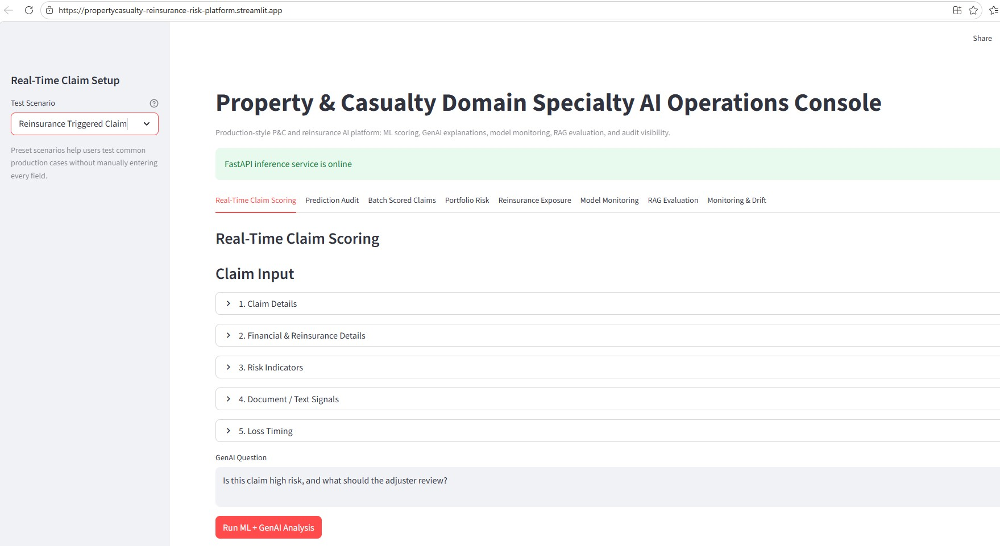
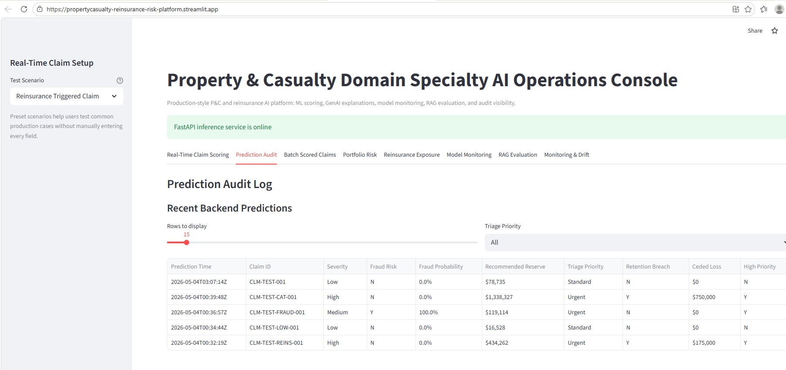
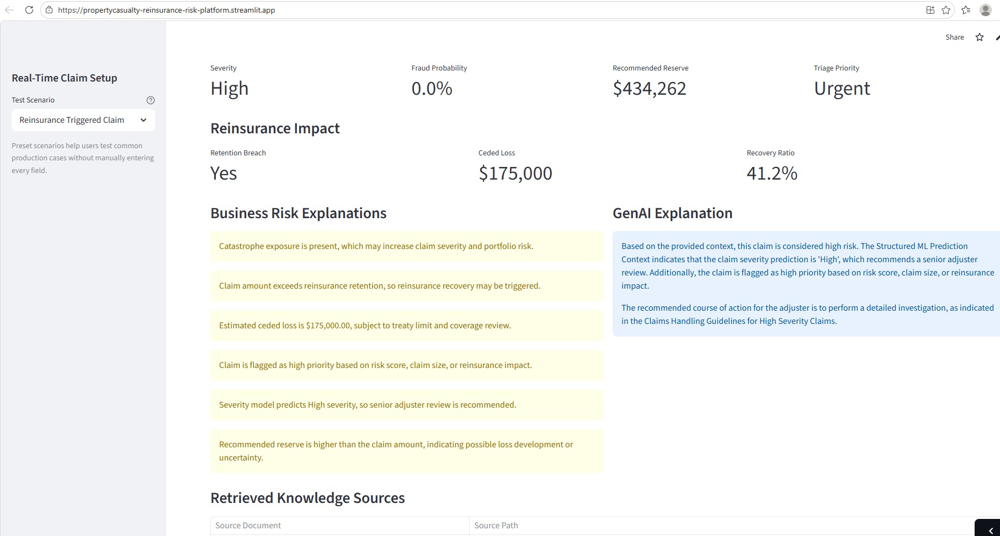
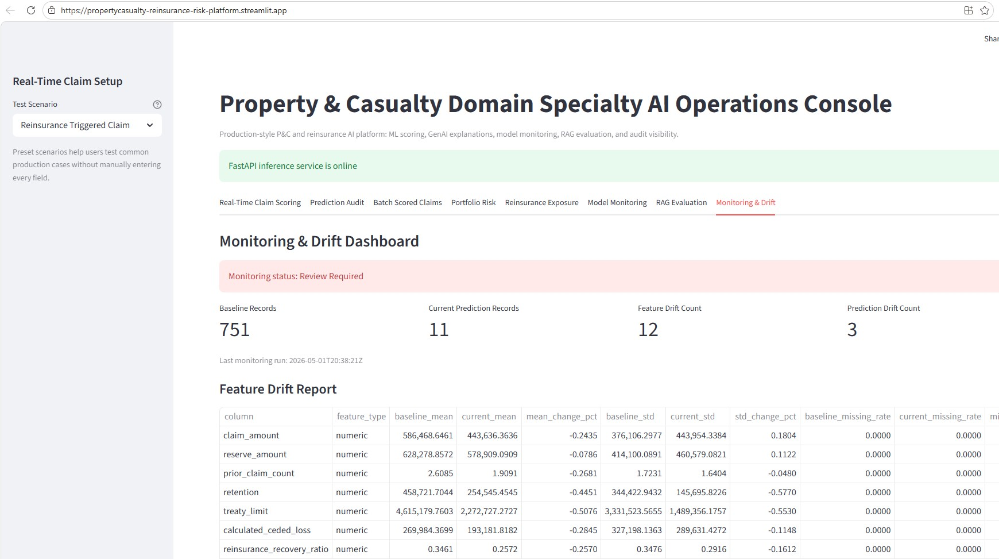

# P&C Insurance AI Risk & Reinsurance Analytics Platform


Enterprise style AI platform designed for Property & Casualty (P&C) insurance and reinsurance environments, combining Machine Learning, Retrieval Augmented Generation (RAG), near real-time risk scoring, reinsurance analytics, and MLOps observability workflows.

---
## Project Link

[](https://propertycasualty-reinsurance-risk-platform.streamlit.app/)

---
# Executive Summary

This project demonstrates how enterprise AI systems can support Property & Casualty insurance workflows using Machine Learning, Generative AI, and cloud native data engineering patterns.

The platform simulates a production style insurance AI environment used by:
- Claims Adjusters
- Fraud Investigation Teams
- Risk Analysts
- Reinsurance Operations Teams
- Claims Management Organizations

The solution combines:
- ML based risk prediction
- Fraud scoring workflows
- Reinsurance analytics
- RAG based explainable AI
- Audit logging and monitoring
- Lakehouse style data architecture
- API driven deployment patterns
- MLOps observability workflows

---

# Business Problem

Insurance organizations process large volumes of claims requiring:
- Severity assessment
- Fraud evaluation
- Reserve estimation
- Reinsurance exposure analysis
- Explainable decision support

Traditional claims workflows often rely heavily on:
- Manual document review
- Static business rules
- Limited explainability
- Delayed triage decisions

This platform demonstrates how AI driven workflows can improve claims prioritization, fraud detection, and operational decision support while maintaining explainability and monitoring controls.

---
# Application Screenshots

## Near Real-Time Claim Scoring


## Prediction Audit Dashboard


## GenAI Explanation (RAG)


## Model Monitoring & Drift Detection


---

# Enterprise Features

- Near real-time claim scoring
- Fraud risk prediction
- Reserve estimation workflows
- Reinsurance exposure analytics
- RAG based explainable AI
- Prediction audit logging
- ML monitoring & observability
- Lakehouse style data architecture
- REST API integration
- CI/CD deployment workflows

---
# Core Capabilities

## Near Real-Time Claim Scoring

The platform predicts:
- Claim severity classification
- Fraud probability scoring
- Recommended reserve estimation
- Claims triage priority

Outputs support faster operational decision making for claims teams.

---

## Reinsurance Analytics

The system includes:
- Retention breach detection
- Ceded loss calculations
- Recovery ratio estimation
- Reinsurance exposure analysis

These workflows simulate operational reinsurance analytics used in enterprise insurance environments.

---

## RAG Based Explainable AI

The GenAI layer generates contextual explanations using:
- Structured claims data
- Claim notes
- Adjuster emails
- Accord XML documents
- Reinsurance documents

The platform combines semantic retrieval with LLM generated responses to improve explainability and operational transparency.

---

## MLOps & Observability

The platform incorporates:
- Prediction audit logging
- Model drift monitoring
- Prediction quality tracking
- Inference monitoring workflows
- CI/CD deployment automation

---

# Enterprise Architecture

## High Level Workflow

```text
User Request (Streamlit UI)
        ↓
FastAPI Inference Layer
        ↓
ML Prediction Services
 ├── Claim Severity Model
 ├── Fraud Risk Model
 ├── Reserve Estimation Model
        ↓
RAG Orchestration Layer
        ├── Claim Notes
        ├── Adjuster Emails
        ├── Accord XML
        ├── Reinsurance Documents
        ↓
FAISS Semantic Vector Search
        ↓
LLM Explanation Generation
        ↓
Prediction + Explainable AI Response
        ↓
Audit Logging & Monitoring
```

---

# Lakehouse Data Pipeline

The platform follows a Lakehouse-style data architecture:

```text
Bronze Layer (Raw Ingestion)
        ↓
Silver Layer (Cleaning & Standardization)
        ↓
Gold Layer (Feature Engineering & Analytics)
        ↓
ML Models + RAG Workflows
```

---

# Governance & Explainability

The platform incorporates explainable AI workflows designed for regulated insurance environments:

- Source grounded AI explanations
- Structured claim context prioritization
- Prediction audit logging
- Drift monitoring workflows
- Explainable risk factor summaries
- Controlled retrieval pipelines for GenAI responses

---

# Example Use Case

A claims adjuster submits a new claim:

| Input | Value |
|---|---|
| Loss Type | Hail |
| State | TX |
| Claim Amount | $425,000 |

## System Output

| Output | Result |
|---|---|
| Severity | High |
| Fraud Risk | Low |
| Recommended Reserve | $434K |
| Triage Priority | Urgent |
| Reinsurance | Retention breached → Ceded loss triggered |
| GenAI Explanation | Risk drivers + recommended actions |

### Outcome

- Faster claims triage
- Reduced manual review effort
- Improved operational visibility
- Better reserve and reinsurance decision support

---

# Technology Stack

| Layer | Technologies |
|---|---|
| Frontend | Streamlit |
| Backend | FastAPI |
| Machine Learning | Scikit-learn |
| GenAI | LangChain + Groq |
| Vector Search | FAISS |
| Embeddings | Hugging Face |
| Data Engineering | Pandas |
| Deployment | Docker |
| CI/CD | GitHub Actions |

---

# Repository Structure

```text
project/
│
├── api/              → FastAPI backend services
├── app/              → Streamlit frontend dashboards
├── src/              → ML pipelines & RAG workflows
├── data/             → Bronze / Silver / Gold datasets
├── vectorstore/      → FAISS vector indexes
├── monitoring/       → Drift monitoring workflows
├── evaluation/       → ML evaluation & testing
├── tests/            → Unit tests
├── screenshots/      → Application screenshots
├── requirements.txt
└── README.md
```

---

# Deployment Architecture

The platform supports:
- Streamlit Cloud deployment
- Dockerized FastAPI services
- GitHub Actions CI/CD workflows
- Cloud ready deployment architecture patterns

---

# Business Impact

- Accelerated claims triage and investigation workflows
- Improved fraud risk visibility using ML driven scoring
- Enhanced explainability through RAG based AI responses
- Reduced manual review effort for claims operations teams
- Improved reinsurance exposure analysis and reserve visibility
- Demonstrated enterprise AI and MLOps implementation patterns for regulated insurance environments

---

# Future Enhancements

- Azure Databricks integration
- MLflow experiment tracking
- Real time streaming ingestion
- Enterprise RBAC integration
- Human-in-the-loop review workflows
- Advanced drift analytics
- Vector database scalability enhancements

---

# Disclaimer

This project is intended for:
- Educational purposes
- Portfolio demonstrations
- Enterprise AI architecture simulations

No real customer, claims, policyholder, or reinsurance data is used.

---

# 👨‍💻 Author

Vishnu Yadavalli

---

⭐ Enterprise-style AI platform demonstrating practical Machine Learning, RAG, reinsurance analytics, and MLOps implementation patterns for regulated insurance environments.
